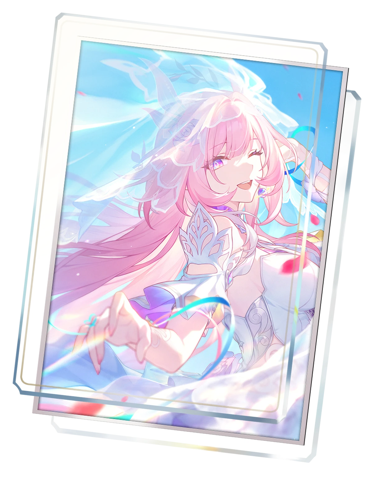

## 👋 Welcome to my GitHub profile!

Hi there! I'm a Software Engineering student passionate about building things and learning new technologies. Currently diving deep into computer science fundamentals through CS61A, CS61B, and CS106B/L while vibing with code.

### 🎯 Current Focus
- 📚 Mastering data structures and algorithms
- 🌱 Exploring functional programming paradigms
- 🛠️ Building full-stack web applications
- 🚀 Contributing to open-source projects

### 🧰 Tech Stack

#### Programming Languages

<picture>
  <source media="(prefers-color-scheme: dark)" srcset="https://skillicons.dev/icons?i=py,java,cpp,go,rust,c,haskell,ts,js,clojure,html,css,wasm,lua&theme=dark">
  
</picture>

#### Frameworks & Libraries

<picture>
  <source media="(prefers-color-scheme: dark)" srcset="https://skillicons.dev/icons?i=spring,tailwind,vue,react,nodejs,nextjs,nuxtjs,electron,express,fastapi,flask&theme=dark">
  
</picture>

<picture>
  <source media="(prefers-color-scheme: dark)" srcset="https://skillicons.dev/icons?i=threejs&theme=dark">
  
</picture>

#### Operating Systems

<picture>
  <source media="(prefers-color-scheme: dark)" srcset="https://skillicons.dev/icons?i=debian,arch,ubuntu,kali,nix,linux,windows&theme=dark">
  
</picture>

#### Tools & Technologies

<picture>
  <source media="(prefers-color-scheme: dark)" srcset="https://skillicons.dev/icons?i=vscode,idea,docker,git,vim,cmake,npm,webpack,vite,figma,bash,powershell,notion&theme=dark">
  
</picture>

### 🌐 Languages
- 🇨🇳 Simplified Chinese / 中文 (Native)
- 🇬🇧 English (Intermediate - Learning & Improving)

### ✅ Beyond Coding
When I'm not coding, you'll find me:
- 🎮 Gaming (Minecraft Java Edition and other platforms)
- 🔧 Building and customizing computers
- 🎬 Watching movies and TV shows
- 🎥 Creating and editing video content

### 📊 GitHub Stats

  <picture>
    <source media="(prefers-color-scheme: dark)" srcset="https://github-readme-stats.vercel.app/api?username=hygroupseries&show_icons=true&hide_border=true&theme=github_dark">
    
  </picture>
  <picture>
    <source media="(prefers-color-scheme: dark)" srcset="https://github-readme-stats.vercel.app/api/top-langs/?username=hygroupseries&layout=compact&hide_border=true&theme=github_dark">
    
  </picture>

  <picture>
    <source media="(prefers-color-scheme: dark)" srcset="https://streak-stats.demolab.com/?user=hygroupseries&hide_border=true&theme=github-dark-blue">
    
  </picture>

  <picture>
    <source media="(prefers-color-scheme: dark)" srcset="https://github-profile-trophy.vercel.app/?username=hygroupseries&theme=darkhub&no-frame=true&margin-w=8">
    
  </picture>

  <picture>
    <source media="(prefers-color-scheme: dark)" srcset="https://raw.githubusercontent.com/hygroupseries/hygroupseries/output/github-contribution-grid-snake-dark.svg">
    
  </picture>

---

  <i>La vida es una lenteja, o la tomas o la dejas.</i>

---

### 🖼️ Daily Bing Wallpaper

A [GitHub Actions workflow](.github/workflows/bing-wallpaper.yml) fetches the Bing wallpaper of the day (ja-JP edition) and archives it into [`wallpapers/`](wallpapers/) every day — over 200 wallpapers and counting.

